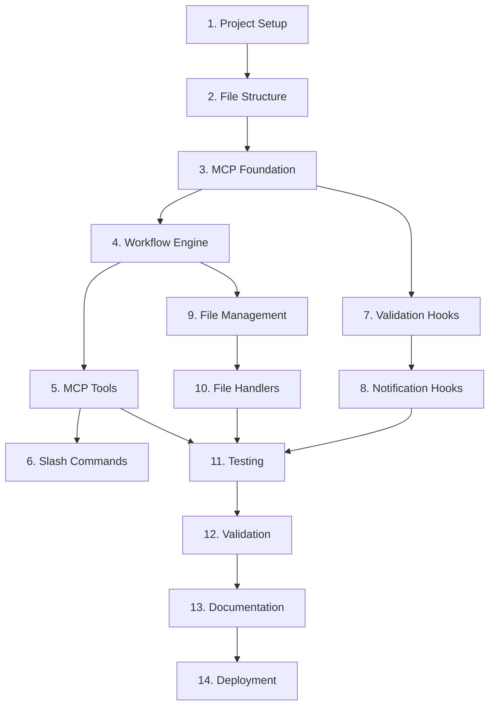

# Implementation Tasks: Specster Implementation

## Task Breakdown

### Phase 1: Core Infrastructure Setup

- [ ] 1. Initialize project structure and dependencies
  - Create Node.js project for MCP server with TypeScript
  - Install MCP SDK and required dependencies
  - Set up build configuration (tsconfig.json, package.json)
  - Create basic directory structure for MCP server
  - _Requirements: Technical Requirements, Integration Requirements_

- [ ] 2. Create file system structure and templates
  - [ ] 2.1 Create `.specster` directory structure
    - Create specs/, state/, templates/, config/, hooks/ directories
    - Set up proper permissions and .gitignore entries
    - Create example directory structure documentation
    - _Requirements: Data Requirements, File System Organization_

  - [ ] 2.2 Create specification templates
    - Create requirements-template.md with EARS format examples
    - Create design-template.md with architecture sections
    - Create tasks-template.md with task breakdown structure
    - Add template variable substitution system
    - _Requirements: Story 2, Story 3, Story 4_

- [ ] 3. Set up MCP server foundation
  - [ ] 3.1 Create basic MCP server structure
    - Initialize MCP server with proper TypeScript interfaces
    - Set up tool registration and handler framework
    - Create configuration loading system
    - Implement basic logging and error handling
    - _Requirements: Integration Requirements, Technical Requirements_

  - [ ] 3.2 Implement core data models
    - Create TypeScript interfaces for SpecState, PhaseInfo, etc.
    - Implement Phase enum and transition validation
    - Create state serialization/deserialization functions
    - Add validation functions for spec names and file paths
    - _Requirements: Data Requirements, Security Requirements_

### Phase 2: Core Workflow Engine

- [ ] 4. Implement workflow state management
  - [ ] 4.1 Create StateManager class
    - Implement file-based state persistence
    - Add state caching with expiration
    - Create state loading and saving functions
    - Add concurrent access protection
    - _Requirements: Story 5, Story 6, Reliability Requirements_

  - [ ] 4.2 Implement WorkflowEngine class
    - Create phase transition validation logic
    - Implement approval requirement checking
    - Add workflow history tracking
    - Create phase progression rules
    - _Requirements: Story 1, Epic acceptance criteria_

- [ ] 5. Build MCP server tools
  - [ ] 5.1 Implement specification initialization
    - Create `initializeSpec` MCP tool
    - Add spec directory creation logic
    - Implement template application system
    - Add duplicate spec name validation
    - _Requirements: Story 1_

  - [ ] 5.2 Implement phase management tools
    - Create `enterRequirementsPhase` tool
    - Create `generateDesign` tool
    - Create `createImplementationTasks` tool
    - Add phase transition validation
    - _Requirements: Story 2, Story 3, Story 4_

  - [ ] 5.3 Implement status and utility tools
    - Create `getSpecStatus` tool
    - Create `updatePhaseProgress` tool
    - Create `validatePhaseTransition` tool
    - Add error handling and user feedback
    - _Requirements: Story 5, Performance Requirements_

### Phase 3: Custom Slash Commands

- [ ] 6. Create custom slash commands
  - [ ] 6.1 Implement spec-init command
    - Create `.claude/commands/spec-init.md`
    - Add MCP tool call with parameter validation
    - Implement user feedback and error handling
    - Test command integration with Claude Code
    - _Requirements: Story 1, Usability Requirements_

  - [ ] 6.2 Implement phase-specific commands
    - Create `spec-requirements.md` command
    - Create `spec-design.md` command
    - Create `spec-tasks.md` command
    - Add parameter validation and user guidance
    - _Requirements: Story 2, Story 3, Story 4_

  - [ ] 6.3 Implement status command
    - Create `spec-status.md` command
    - Add current phase display and progress tracking
    - Implement multi-spec status overview
    - Add next action guidance
    - _Requirements: Story 5, Usability Requirements_

### Phase 4: Claude Code Hooks Integration

- [ ] 7. Implement validation hooks
  - [ ] 7.1 Create PreToolUse validation hook
    - Create `validate-spec-operation.js` script
    - Add input validation for MCP tool calls
    - Implement security checks (path traversal, etc.)
    - Add phase transition validation
    - _Requirements: Security Requirements, Technical Requirements_

  - [ ] 7.2 Create PostToolUse update hook
    - Create `update-spec-state.js` script
    - Add state persistence after successful operations
    - Implement workflow history logging
    - Add error recovery mechanisms
    - _Requirements: Story 5, Reliability Requirements_

- [ ] 8. Implement notification and tracking hooks
  - [ ] 8.1 Create progress tracking hook
    - Create `track-progress.js` script
    - Add session progress logging
    - Implement milestone notifications
    - Add workflow completion detection
    - _Requirements: Story 5, Performance Requirements_

  - [ ] 8.2 Configure hook integration
    - Create hooks configuration for settings.json
    - Add hook matcher patterns for MCP tools
    - Test hook execution with Claude Code
    - Add hook error handling and recovery
    - _Requirements: Integration Requirements, Reliability Requirements_

### Phase 5: File Operations and Templates

- [ ] 9. Implement file management system
  - [ ] 9.1 Create FileManager class
    - Implement secure file operations
    - Add atomic file writing with backup
    - Create directory structure validation
    - Add file existence and permission checks
    - _Requirements: Technical Requirements, Security Requirements_

  - [ ] 9.2 Implement TemplateManager class
    - Create template loading and parsing system
    - Add variable substitution engine
    - Implement template validation
    - Add custom template support
    - _Requirements: Story 2, Story 3, Story 4_

- [ ] 10. Build specification file handlers
  - [ ] 10.1 Create requirements.md handler
    - Add EARS format validation
    - Implement structured requirements parsing
    - Create user story template system
    - Add acceptance criteria validation
    - _Requirements: Story 2, Usability Requirements_

  - [ ] 10.2 Create design.md handler
    - Add Mermaid diagram validation
    - Implement architecture section templates
    - Create API documentation templates
    - Add design consistency checking
    - _Requirements: Story 3, Technical Requirements_

### Phase 6: Testing and Validation

- [ ] 11. Implement comprehensive testing
  - [ ] 11.1 Create unit tests
    - Test WorkflowEngine phase transitions
    - Test StateManager persistence and caching
    - Test MCP tool implementations
    - Test template rendering and validation
    - _Requirements: Functional Success, Technical Success_

  - [ ] 11.2 Create integration tests
    - Test MCP server startup and tool registration
    - Test slash command execution end-to-end
    - Test hook execution with Claude Code
    - Test file operations and state persistence
    - _Requirements: Integration Requirements, Reliability Requirements_

- [ ] 12. Implement validation and error handling
  - [ ] 12.1 Add input validation
    - Validate spec names and descriptions
    - Add file path security validation
    - Implement phase transition validation
    - Add MCP tool parameter validation
    - _Requirements: Security Requirements, Usability Requirements_

  - [ ] 12.2 Create error recovery systems
    - Add corrupted state file recovery
    - Implement incomplete operation recovery
    - Create user-friendly error messages
    - Add automatic backup and restore
    - _Requirements: Reliability Requirements, Usability Requirements_

### Phase 7: Documentation and Deployment

- [ ] 13. Create user documentation
  - [ ] 13.1 Write installation guide
    - Create MCP server installation instructions
    - Add Claude Code configuration steps
    - Create hook setup documentation
    - Add troubleshooting guide
    - _Requirements: User Experience Success, Technical Success_

  - [ ] 13.2 Create usage documentation
    - Document slash command usage
    - Create workflow best practices guide
    - Add template customization guide
    - Create examples and tutorials
    - _Requirements: Usability Requirements, User Experience Success_

- [ ] 14. Implement deployment automation
  - [ ] 14.1 Create installation scripts
    - Add automated MCP server setup
    - Create Claude Code configuration script
    - Add hook installation automation
    - Implement dependency checking
    - _Requirements: Technical Success, User Experience Success_

  - [ ] 14.2 Create distribution package
    - Build NPM package for MCP server
    - Create installation verification script
    - Add configuration validation tools
    - Create uninstall/cleanup scripts
    - _Requirements: Technical Requirements, Usability Requirements_

## Task Dependencies

## Implementation Progress

- Requirements Phase: ✅ Complete
- Design Phase: ✅ Complete
- Implementation Phase: 🔄 Ready to Begin (0/14 major tasks complete)

## Development Notes

### Phase 1 Priority
Focus on core infrastructure first - MCP server foundation and file system structure are prerequisites for everything else.

### Testing Strategy
Implement tests alongside each component rather than at the end to catch integration issues early.

### Security Considerations
Every file operation and user input must be validated against path traversal and injection attacks.

### Performance Targets
- MCP server startup: < 2 seconds
- Command execution: < 5 seconds
- State persistence: < 1 second
- Hook execution: < 500ms

### Error Handling Priority
Robust error handling is critical since this system manages developer workflows - failures must be graceful and recoverable.

## Next Steps

1. **Start with Task 1**: Set up the basic Node.js project structure
2. **Create MVP**: Focus on core workflow (init → requirements → design → tasks)
3. **Iterate**: Add hooks and advanced features after core functionality works
4. **Test Early**: Validate each component works with Claude Code before moving to next phase
5. **Document**: Keep documentation updated as implementation progresses

Each task should be completed fully before moving to the next, with manual testing against the requirements to ensure correctness.