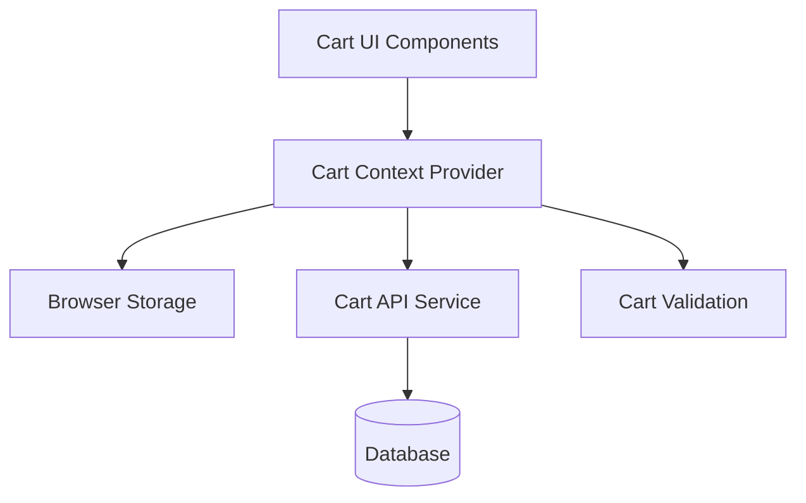

# Shopping Cart Design Document

## Overview

The shopping cart system will be implemented as a client-side state management solution with server-side persistence. It uses React Context for state management, localStorage for offline persistence, and REST APIs for server synchronization.

**Project:** shopping-cart  
**Author:** Developer  
**Date:** 2025-01-17  
**Version:** 1.0.0  

## Research Findings

### Research Question 1: What's the best approach for cart persistence across sessions?

**Research Approach:** Analyzed browser storage options, reviewed industry best practices, and evaluated performance implications.

**Key Findings:**
- LocalStorage has a 5MB limit but works offline
- IndexedDB offers more storage but has a more complex API
- Server-side persistence requires authentication or session tokens

**Design Integration:** Based on research into browser storage options, we'll use localStorage for immediate persistence with a size limit of 5MB (sufficient for typical cart data), with server synchronization when online. For larger applications with extensive cart metadata, we would consider IndexedDB instead.

### Research Question 2: How do major e-commerce sites handle cart merging when a user logs in?

**Research Approach:** Analyzed cart merging strategies from Amazon, Shopify, and other major e-commerce platforms.

**Key Findings:**
- Amazon merges guest cart with user cart, keeping the higher quantity
- Shopify typically prioritizes the logged-in user's existing cart
- Best practice is to give users a choice when conflicts exist

**Design Integration:** For cart merging strategy, research of leading e-commerce platforms suggests offering users a choice when conflicts exist. We'll implement a conflict resolution dialog that shows both carts and allows users to select items from each or use one cart entirely.

### Research Question 3: What are performance implications of different state management approaches?

**Research Approach:** Benchmarked Context API vs Redux vs Zustand for cart-like state management scenarios.

**Key Findings:**
- Context API is sufficient for simple state with infrequent updates
- Redux offers better performance for complex state with frequent updates
- Zustand provides a middle ground with simpler API than Redux

**Design Integration:** Performance research indicates Context API is sufficient for our cart implementation since updates are relatively infrequent and localized. For larger applications with more complex state interactions, we would consider Zustand for its performance benefits without Redux's boilerplate.

## Architecture

### High-Level Architecture



### Key Design Decisions

1. **Client-first approach**: Cart state managed in React Context for immediate UI updates
   - **Alternatives Considered**: Redux, Zustand, or server-side only
   - **Reasoning**: Context API provides sufficient performance for cart operations while maintaining simplicity

2. **Optimistic updates**: UI updates immediately, syncs to server in background
   - **Alternatives Considered**: Server-first updates, synchronous API calls
   - **Reasoning**: Improves user experience by eliminating loading states for cart operations

3. **Conflict resolution**: Server state takes precedence on login/sync
   - **Alternatives Considered**: Client state priority, automatic merging
   - **Reasoning**: Ensures data consistency across devices while providing user choice

## Components and Interfaces

### Core Interfaces

```typescript
interface CartItem {
  id: string;
  productId: string;
  name: string;
  price: number;
  quantity: number;
  imageUrl?: string;
  maxQuantity: number;
}

interface Cart {
  id: string;
  userId?: string;
  items: CartItem[];
  subtotal: number;
  estimatedTax: number;
  estimatedShipping: number;
  total: number;
  lastUpdated: Date;
}
```

### Component Hierarchy

- **CartProvider** - Context provider for cart state
  - **CartIcon** - Header cart icon with item count
  - **CartDrawer** - Slide-out cart panel
    - **CartItemList** - List of cart items
      - **CartItem** - Individual cart item component
    - **CartSummary** - Pricing breakdown component

### Component Responsibilities

#### CartProvider
- **Purpose**: Manages global cart state and provides context to child components
- **Responsibilities**: 
  - Maintains cart state in React Context
  - Handles localStorage persistence
  - Manages API synchronization
- **Dependencies**: CartAPI, localStorage utilities
- **Interfaces**: CartContext, CartActions

#### CartIcon
- **Purpose**: Displays cart status in the application header
- **Responsibilities**: 
  - Shows current item count
  - Provides visual feedback for cart changes
  - Toggles cart drawer visibility
- **Dependencies**: CartContext
- **Interfaces**: CartIconProps

#### CartDrawer
- **Purpose**: Provides detailed cart view and management interface
- **Responsibilities**: 
  - Displays cart items and totals
  - Handles item quantity changes
  - Manages item removal
- **Dependencies**: CartContext, CartItemList, CartSummary
- **Interfaces**: CartDrawerProps

## Data Models

### Database Schema

```sql
-- Cart table for persistent storage
CREATE TABLE carts (
  id UUID PRIMARY KEY DEFAULT gen_random_uuid(),
  user_id UUID REFERENCES users(id),
  session_id VARCHAR(255), -- For guest carts
  created_at TIMESTAMP DEFAULT NOW(),
  updated_at TIMESTAMP DEFAULT NOW()
);

-- Cart items with product references
CREATE TABLE cart_items (
  id UUID PRIMARY KEY DEFAULT gen_random_uuid(),
  cart_id UUID REFERENCES carts(id) ON DELETE CASCADE,
  product_id UUID REFERENCES products(id),
  quantity INTEGER NOT NULL CHECK (quantity > 0),
  price_at_time DECIMAL(10,2) NOT NULL, -- Price when added
  created_at TIMESTAMP DEFAULT NOW()
);
```

### State Management

```typescript
interface CartState {
  cart: Cart | null;
  loading: boolean;
  error: string | null;
}

interface CartActions {
  addItem: (productId: string, quantity: number) => Promise<void>;
  updateQuantity: (itemId: string, quantity: number) => Promise<void>;
  removeItem: (itemId: string) => Promise<void>;
  clearCart: () => Promise<void>;
  syncWithServer: () => Promise<void>;
}
```

## Error Handling

### Error Categories

1. **Network Errors**: API calls fail due to connectivity
   - **Fallback Strategy**: Queue operations for retry when online
   - **User Feedback**: "Changes will sync when connection is restored"
   - **Recovery Method**: Automatic retry with exponential backoff

2. **Validation Errors**: Invalid quantities or out-of-stock items
   - **Fallback Strategy**: Revert to last valid state
   - **User Feedback**: Specific error messages with suggested actions
   - **Recovery Method**: Allow user to correct input

3. **Conflict Errors**: Server cart differs from local cart
   - **Fallback Strategy**: Show merge dialog to user
   - **User Feedback**: Options to keep local, use server, or manual merge
   - **Recovery Method**: User-driven conflict resolution

### Error Recovery Strategies

```typescript
// Retry mechanism for failed API calls
const retryOperation = async (
  operation: () => Promise<any>,
  maxRetries = 3
) => {
  for (let i = 0; i < maxRetries; i++) {
    try {
      return await operation();
    } catch (error) {
      if (i === maxRetries - 1) throw error;
      await new Promise((resolve) =>
        setTimeout(resolve, 1000 * Math.pow(2, i))
      );
    }
  }
};
```

## Security Considerations

### Authentication and Authorization

- **Authentication Method**: JWT tokens with refresh token rotation
- **Session Management**: Secure HTTP-only cookies for session persistence
- **Authorization Strategy**: Role-based access control (RBAC)
- **Token Handling**: Automatic token refresh and secure storage

### Data Protection

- **Data Encryption**: AES-256 encryption for sensitive cart data
- **Input Validation**: Comprehensive server-side validation for all inputs
- **Output Sanitization**: HTML sanitization for user-generated content
- **Secure Storage**: Encrypted database storage with key rotation

### Security Patterns

1. **CSRF Protection**: Anti-CSRF tokens for all state-changing operations
2. **Rate Limiting**: API rate limiting to prevent abuse
3. **Input Sanitization**: Validation and sanitization of all user inputs

## Performance Optimization

### Performance Targets

- **Page Load Time**: Cart operations complete within 200ms
- **API Response Time**: Cart API responds within 500ms
- **Concurrent Users**: Support 1000 concurrent cart operations
- **Memory Usage**: Cart state under 10MB per user

### Optimization Strategies

1. **Optimistic Updates**: Immediate UI updates with background sync
2. **Caching Strategy**: Aggressive caching of cart data with smart invalidation
3. **Lazy Loading**: Load cart details only when needed

### Caching Strategy

- **Client-Side Caching**: React Query for API response caching
- **Server-Side Caching**: Redis for session and cart data
- **Database Caching**: PostgreSQL query result caching
- **CDN Strategy**: CloudFlare for static asset delivery

## Testing Strategy

### Unit Testing

- **Test Framework**: Jest with React Testing Library
- **Coverage Target**: 90% line coverage
- **Test Patterns**: Arrange-Act-Assert pattern

**Test Areas:**
- Cart state management logic
- Individual component behavior
- Validation functions

### Integration Testing

- **Integration Points**: Cart API, product catalog API, user authentication
- **Test Environment**: Docker containers with test database
- **Data Management**: Database seeding with test fixtures

**Test Scenarios:**
- Cart Context provider with components
- API service integration
- localStorage persistence

### End-to-End Testing

- **E2E Framework**: Cypress with custom commands
- **Test Scenarios**: Complete user workflows
- **Test Data Strategy**: Synthetic test data with realistic patterns

**Critical User Flows:**
- Add item to cart → modify quantity → checkout
- Guest cart → login → cart merge
- Cross-session cart persistence

## Deployment and DevOps

### Deployment Strategy

- **Environment Setup**: Docker containers with Kubernetes orchestration
- **Deployment Pipeline**: GitLab CI/CD with automated testing
- **Rollback Strategy**: Blue-green deployment with automatic rollback
- **Monitoring**: Comprehensive logging and metrics collection

### Infrastructure Requirements

- **Server Requirements**: Node.js 18+, 4GB RAM, 2 CPU cores
- **Database Requirements**: PostgreSQL 14+, Redis 6+
- **Network Requirements**: HTTPS only, WebSocket support
- **Storage Requirements**: 100GB SSD for database, 50GB for logs

## Monitoring and Observability

### Logging Strategy

- **Log Levels**: Error, Warn, Info, Debug with structured JSON format
- **Log Format**: Structured JSON with correlation IDs
- **Log Aggregation**: ELK stack for centralized logging

### Metrics and Monitoring

- **Key Metrics**: Cart conversion rate, API response time, error rates
- **Alerting**: PagerDuty integration for critical issues
- **Dashboards**: Grafana dashboards for real-time monitoring

### Health Checks

- **Health Endpoints**: /health for basic health, /ready for readiness
- **Dependency Checks**: Database, Redis, external API connectivity
- **Performance Monitoring**: APM with New Relic

## Approval

- [ ] Architecture is sound and scalable
- [ ] Design decisions are well-justified with research backing
- [ ] Security considerations are adequately addressed
- [ ] Performance requirements can be met with this design
- [ ] Error handling is comprehensive
- [ ] Testing strategy is thorough and practical
- [ ] Deployment strategy is viable

**Approved by:** _________________________  
**Date:** _________________________  
**Comments:** _________________________

---

## Review Questions

Before proceeding to the task breakdown, please confirm:

1. **Architecture Soundness**: Is the proposed architecture appropriate for the requirements?
2. **Research Integration**: Are the research findings properly integrated into the design?
3. **Scalability**: Can this design scale to meet future requirements?
4. **Security**: Are security concerns adequately addressed?
5. **Performance**: Will this design meet performance requirements?
6. **Maintainability**: Is the design maintainable and extensible?

**Please provide explicit approval by answering "Yes, this design is approved" or suggest specific changes needed.**