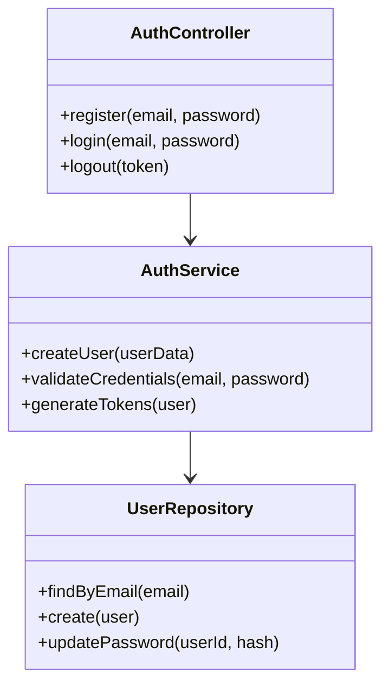
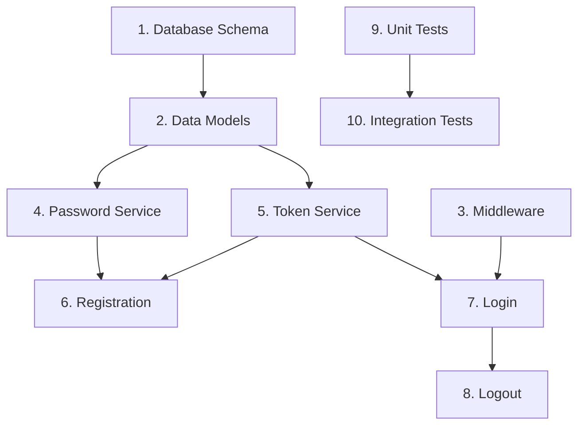

# Specster - Spec-Driven Development with Claude Code

## System Overview

Specster implements a three-phase spec-driven development methodology using Claude Code's MCP servers, custom commands, and hooks. The system orchestrates requirements gathering, design documentation, and task implementation while maintaining living specifications that evolve with code changes.

## Core Architecture Components

### 1. MCP Server (specster-server)
Central workflow orchestrator that manages:
- Phase state transitions and validation
- Specification file synchronization 
- Workflow rule enforcement
- Cross-session state persistence

### 2. Custom Commands (Claude Code slash commands)
Developer interface through Claude Code commands:
- `/spec-init` - Initialize new specification
- `/spec-requirements` - Enter requirements phase
- `/spec-design` - Generate design documentation
- `/spec-tasks` - Create implementation tasks
- `/spec-status` - Check specification status

### 3. Claude Code Hooks
Quality automation through Claude Code's hook system:
- **PreToolUse** - Validate before spec operations
- **PostToolUse** - Update state after operations
- **Notification** - Track progress and changes

### 4. File System Structure
Organized specification management:
```
.specster/
├── specs/
│   └── {feature-name}/
│       ├── requirements.md
│       ├── design.md
│       └── tasks.md
├── config/
│   ├── mcp-config.json
│   └── workflow-rules.yml
├── templates/
│   ├── requirements-template.md
│   ├── design-template.md
│   └── tasks-template.md
└── state/
    └── workflow-state.json
```

## System Architecture Diagram

```mermaid
graph TB
    Dev[Developer] --> CC[Claude Code CLI]
    CC --> Cmd[Custom Commands]
    CC --> MCP[Specster MCP Server]
    CC --> Hooks[Claude Code Hooks]
    
    subgraph "Specster MCP Server"
        WE[Workflow Engine]
        SM[State Manager]
        FS[File Sync]
        VE[Validation Engine]
    end
    
    subgraph "Claude Code Commands"
        SI[/spec-init]
        SR[/spec-requirements]
        SD[/spec-design]
        ST[/spec-tasks]
        SS[/spec-status]
    end
    
    subgraph "Claude Code Hooks"
        PTU[PreToolUse]
        POTU[PostToolUse]
        NOTIF[Notification]
    end
    
    subgraph "File System"
        Specs[.specster/specs/]
        Config[.specster/config/]
        Templates[.specster/templates/]
        State[.specster/state/]
    end
    
    MCP --> Specs
    MCP --> State
    Cmd --> MCP
    Hooks --> MCP
    
    classDef primary fill:#e1f5fe
    classDef secondary fill:#f3e5f5
    classDef storage fill:#e8f5e8
    
    class MCP,WE,SM,FS,VE primary
    class Cmd,Hooks secondary
    class Specs,Config,Templates,State storage
```

## Detailed Component Design

### Specster MCP Server Implementation

```typescript
interface SpecsterMCPServer {
  // Core workflow tools
  tools: {
    initializeSpec(name: string, description: string): SpecResult
    enterRequirementsPhase(specName: string): PhaseResult  
    generateDesign(specName: string): DesignResult
    createImplementationTasks(specName: string): TaskResult
    validatePhaseTransition(from: Phase, to: Phase): ValidationResult
    updateTaskProgress(specName: string, taskId: string, status: string): ProgressResult
  }
  
  // State management
  state: {
    currentPhase: Phase
    activeSpecs: Map<string, SpecState>
    workflowHistory: WorkflowEvent[]
    validationRules: ValidationRule[]
  }
  
  // File synchronization
  sync: {
    watchSpecFiles(): void
    syncCodeChanges(): void
    updateTaskProgress(): void
    maintainLivingDocs(): void
  }
}

enum Phase {
  INIT = "init",
  REQUIREMENTS = "requirements", 
  DESIGN = "design",
  IMPLEMENTATION = "implementation",
  COMPLETE = "complete"
}
```

### Claude Code Custom Commands

Commands stored in `.claude/commands/` directory:

```typescript
interface CommandDefinition {
  name: string
  description: string
  parameters: Parameter[]
  template: string
  mcpCalls: MCPCall[]
}

// Example: spec-requirements command
const specRequirementsCommand = {
  name: "spec-requirements",
  template: `
# Requirements Phase for {{spec}}

I'll guide you through requirements gathering using EARS notation.

<mcp_call server="specster-server">
enter_requirements_phase
{
  "specName": "{{spec}}"
}
</mcp_call>

Let's work together to create structured requirements...
  `
}
```

### Claude Code Hooks Integration

Using Claude Code's native hook system in `.claude/hooks/`:

```typescript
// .claude/hooks/specster-hooks.ts
export const hooks = {
  PreToolUse: async (context) => {
    // Validate before MCP operations
    if (context.toolName.startsWith('specster')) {
      return await validateSpecsterOperation(context);
    }
    return { continue: true };
  },
  
  PostToolUse: async (context) => {
    // Update state after operations
    if (context.toolName.startsWith('specster')) {
      await updateSpecsterState(context);
    }
    return { continue: true };
  },
  
  Notification: async (context) => {
    // Track progress and changes
    if (context.type === 'spec_phase_change') {
      await logPhaseTransition(context);
    }
    return { continue: true };
  }
};
```

## Phase-by-Phase Workflow Examples

### Phase 1: Requirements Gathering

**Developer Input:**
```bash
claude /spec-init user-authentication "Add login and registration system"
```

**System Response via MCP:**
```json
{
  "action": "initialize_spec",
  "result": {
    "specName": "user-authentication",
    "phase": "init",
    "filesCreated": [
      ".specster/specs/user-authentication/requirements.md",
      ".specster/specs/user-authentication/design.md", 
      ".specster/specs/user-authentication/tasks.md"
    ],
    "nextStep": "Use /spec-requirements user-authentication to begin"
  }
}
```

**Continue with requirements:**
```bash
claude /spec-requirements user-authentication
```

**Generated Requirements Document:**
```markdown
# Requirements Specification: User Authentication

## Overview
Add comprehensive login and registration system for the application.

## User Stories

### Epic: User Authentication
As a new user, I want to create an account so that I can access personalized features.

**Acceptance Criteria (EARS notation):**
- WHEN a user provides valid email and password THEN the system SHALL create a new account
- IF email already exists THEN the system SHALL display "Email already registered" error
- WHEN password is less than 8 characters THEN the system SHALL reject with validation error
- IF user provides invalid email format THEN the system SHALL display format error

### Story: User Login
As a returning user, I want to log in so that I can access my account.

**Acceptance Criteria:**
- WHEN user provides correct credentials THEN system SHALL grant access
- IF user provides incorrect credentials THEN system SHALL display "Invalid credentials" error
- WHEN user fails login 3 times THEN system SHALL temporarily lock account

## Non-Functional Requirements
- Performance: Login SHALL complete within 2 seconds
- Security: Passwords SHALL be hashed using bcrypt
- Accessibility: Forms SHALL be screen reader compatible

## Dependencies
- Email service for verification
- Database for user storage
- Session management system

## Out of Scope
- Two-factor authentication (future release)
- Social login (future enhancement)
```

### Phase 2: Design Documentation

**Developer Input:**
```bash
claude /spec-design user-authentication
```

**System Analysis & Generation:**
The MCP server analyzes the codebase and generates:

```markdown
# Design Document: User Authentication

## Architecture Overview

### Component Architecture


## Data Models

### User Entity
```typescript
interface User {
  id: string;
  email: string;
  passwordHash: string;
  emailVerified: boolean;
  createdAt: Date;
  updatedAt: Date;
}
```

## API Interfaces

### Authentication Endpoints
```typescript
interface AuthAPI {
  POST /api/auth/register: {
    body: { email: string; password: string }
    response: { user: PublicUser; token: string }
  }
  
  POST /api/auth/login: {
    body: { email: string; password: string }
    response: { user: PublicUser; token: string }
  }
}
```

## Security Implementation
- Bcrypt password hashing
- JWT token management
- Rate limiting on login attempts

## Testing Strategy
- Unit tests for all service methods
- Integration tests for complete flows
- Security tests for vulnerability prevention
```

### Phase 3: Implementation Tasks

**Developer Input:**
```bash
claude /spec-tasks user-authentication
```

**Generated Task List:**
```markdown
# Implementation Tasks: User Authentication

## Task Breakdown

### Phase 1: Core Infrastructure
- [ ] 1. Set up database schema and migrations
  - Create users table with required fields
  - Add database indexes for performance
  - _Requirements: Data Models, Performance Requirements_

- [ ] 2. Implement core data models
  - Create User entity with validation
  - Implement database connection
  - _Requirements: 1.1, 1.2_

- [ ] 3. Set up authentication middleware
  - Create JWT token validation middleware
  - Add rate limiting middleware
  - _Requirements: Security Implementation_

### Phase 2: Core Services
- [ ] 4. Implement password hashing service
  - Set up bcrypt hashing
  - Create password validation functions
  - _Requirements: 1.1, Security-1_

- [ ] 5. Create token management service
  - Implement JWT generation
  - Add token refresh logic
  - _Requirements: 1.2, Security-2_

- [ ] 6. Build user registration endpoint
  - Validate input parameters
  - Check for existing users
  - Hash password and create user record
  - _Requirements: 1.1, 2.1_

### Phase 3: Authentication Endpoints
- [ ] 7. Implement user login endpoint
  - Validate credentials against database
  - Generate and return JWT tokens
  - _Requirements: 1.2_

- [ ] 8. Create logout endpoint
  - Validate JWT token
  - Revoke session
  - _Requirements: 1.2_

### Phase 4: Testing
- [ ] 9. Write comprehensive unit tests
  - Test all service layer functions
  - Mock external dependencies
  - _Requirements: Testing Strategy_

- [ ] 10. Create integration tests
  - Test complete user flows
  - Test error scenarios
  - _Requirements: All User Stories_

## Task Dependencies


## Implementation Progress
- Requirements Phase: ✅ Approved
- Design Phase: ✅ Approved  
- Implementation Phase: 🔄 In Progress (0/10 tasks complete)
```

## Real-World Usage Examples

### Typical Development Session

```bash
# Start new feature
claude /spec-init payment-processing "Add Stripe payment integration"

# Work through requirements
claude /spec-requirements payment-processing
# ... interactive requirements gathering ...

# Generate design after approval
claude /spec-design payment-processing
# ... system analyzes codebase and generates architecture ...

# Create implementation tasks
claude /spec-tasks payment-processing
# ... system generates specific tasks ...

# Check progress
claude /spec-status payment-processing
# Shows: 3/15 tasks complete, currently in implementation phase
```

### Cross-Session Continuity

```bash
# Session 1
claude /spec-init user-profiles "User profile management"
# ... work on requirements ...
# Session ends

# Session 2 (later)
claude /spec-status user-profiles
# Shows: Requirements phase complete, ready for design
claude /spec-design user-profiles
# Continues from where left off
```

## Claude Code Configuration

### MCP Server Configuration
```json
// .claude/mcp_servers.json
{
  "specster-server": {
    "command": "node",
    "args": ["dist/server.js"],
    "cwd": ".specster/mcp-server"
  }
}
```

### Hook Configuration
```json
// .claude/hooks.json
{
  "hooks": [
    {
      "name": "specster-hooks",
      "path": ".claude/hooks/specster-hooks.js",
      "events": ["PreToolUse", "PostToolUse", "Notification"]
    }
  ]
}
```

This architecture provides a clean, focused implementation of spec-driven development using Claude Code's native capabilities without external integrations or custom IDE development.