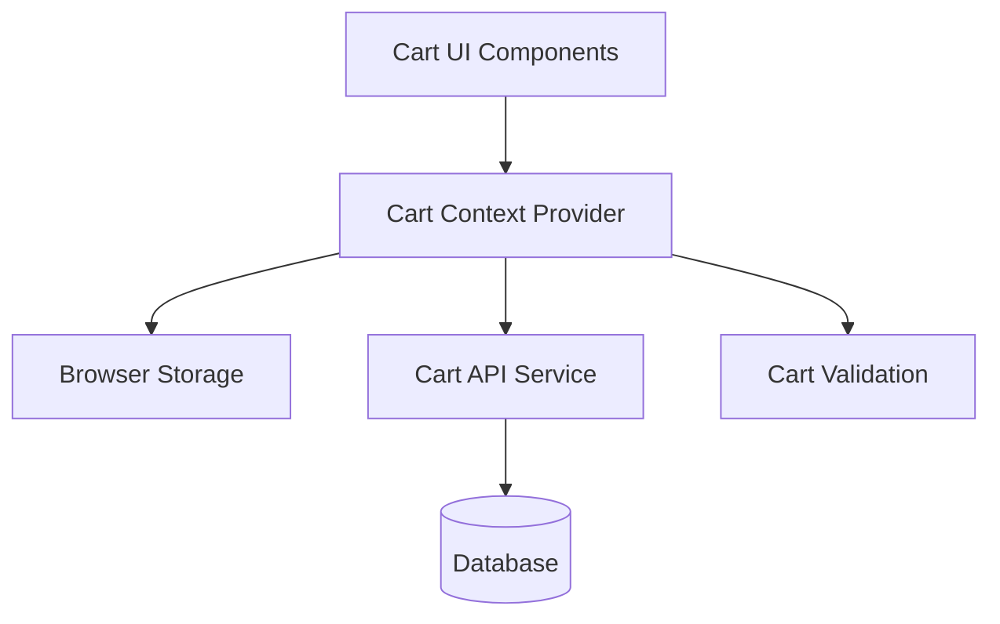

# How specster Specs Work: A Detailed Guide

## Overview

specster Specs is a structured approach to feature development that transforms rough ideas into well-defined, implementable features through a systematic three-phase workflow. As your AI assistant, I guide you through this process to ensure thorough planning before any code is written.

## Core Philosophy

The spec-driven development methodology follows a key principle: **establish ground-truths progressively**. This means we always ensure you're satisfied with each document before moving to the next phase. No assumptions are made - everything requires your explicit approval.

## The Three-Phase Workflow

### Phase 1: Requirements Gathering

**What I do:**

- Create an initial `requirements.md` file based on your rough feature idea
- Generate user stories in the format: "As a [role], I want [feature], so that [benefit]"
- Write acceptance criteria using EARS format (Easy Approach to Requirements Syntax)
- Consider edge cases, user experience, and technical constraints

**EARS Format Examples:**

- `WHEN [event] THEN [system] SHALL [response]`
- `IF [precondition] THEN [system] SHALL [response]`
- `WHEN [event] AND [condition] THEN [system] SHALL [response]`

**Detailed Example - E-commerce Shopping Cart Feature:**

If you say: "I want users to be able to add items to a shopping cart"

I would create something like:

```markdown
# Requirements Document

## Introduction

This feature enables users to manage a shopping cart where they can add, remove, and modify items before checkout. The cart should persist across sessions and provide clear feedback about item availability and pricing.

## Requirements

### Requirement 1: Add Items to Cart

**User Story:** As a customer, I want to add products to my shopping cart, so that I can purchase multiple items in a single transaction.

#### Acceptance Criteria

1. WHEN a user clicks "Add to Cart" on a product page THEN the system SHALL add the item to their cart
2. WHEN an item is added to the cart THEN the system SHALL display a confirmation message
3. WHEN an item is added THEN the cart icon SHALL update to show the new item count
4. IF a product is out of stock THEN the system SHALL disable the "Add to Cart" button
5. WHEN adding an item that's already in the cart THEN the system SHALL increase the quantity instead of creating a duplicate entry

### Requirement 2: View Cart Contents

**User Story:** As a customer, I want to view my cart contents, so that I can review my selections before purchasing.

#### Acceptance Criteria

1. WHEN a user clicks the cart icon THEN the system SHALL display all cart items with names, prices, and quantities
2. WHEN the cart is empty THEN the system SHALL display "Your cart is empty" message
3. WHEN viewing the cart THEN the system SHALL show the subtotal for all items
4. WHEN viewing the cart THEN the system SHALL show estimated taxes and shipping costs

### Requirement 3: Modify Cart Items

**User Story:** As a customer, I want to change quantities or remove items from my cart, so that I can adjust my order before checkout.

#### Acceptance Criteria

1. WHEN a user changes an item quantity THEN the system SHALL update the line total immediately
2. WHEN a user sets quantity to zero THEN the system SHALL remove the item from the cart
3. WHEN a user clicks "Remove" on an item THEN the system SHALL ask for confirmation
4. WHEN the last item is removed THEN the system SHALL display the empty cart message
5. IF a quantity exceeds available stock THEN the system SHALL limit it to available quantity and show a warning
```

**The Review Process:**

- I present the initial requirements document
- Ask explicitly: "Do the requirements look good? If so, we can move on to the design."
- If you request changes, I revise and ask for approval again
- This continues until you give explicit approval (like "yes", "approved", "looks good")

**Common Feedback Scenarios:**

- **"Add guest checkout support"** → I add new requirements for anonymous users
- **"What about mobile users?"** → I add mobile-specific acceptance criteria
- **"We need inventory validation"** → I enhance existing criteria with stock checking
- **"Too complex, let's start simpler"** → I reduce scope to core functionality

**What makes this phase successful:**

- Clear user stories that capture the "why" behind each feature
- Specific, testable acceptance criteria using EARS format
- Consideration of edge cases (out of stock, empty cart, network failures)
- Different user types and contexts (logged in, guest, mobile, desktop)
- Your explicit approval before proceeding

**Red Flags I Watch For:**

- Vague acceptance criteria ("system should work well")
- Missing error scenarios
- Unclear user roles or contexts
- Technical implementation details creeping in too early

### Phase 2: Design Document Creation

**What I do:**

- Conduct necessary research to inform the design decisions
- Create a comprehensive `design.md` file with these sections:
  - Overview
  - Architecture
  - Components and Interfaces
  - Data Models
  - Error Handling
  - Testing Strategy
- Include diagrams using Mermaid when appropriate
- Incorporate research findings directly into design decisions

**Detailed Example - Shopping Cart Design Document:**

Continuing from our shopping cart requirements, I would create:

````markdown
# Shopping Cart Design Document

## Overview

The shopping cart system will be implemented as a client-side state management solution with server-side persistence. It uses React Context for state management, localStorage for offline persistence, and REST APIs for server synchronization.

## Architecture



## Key Design Decisions

- **Client-first approach**: Cart state managed in React Context for immediate UI updates
- **Optimistic updates**: UI updates immediately, syncs to server in background
- **Offline support**: localStorage ensures cart persists across sessions
- **Conflict resolution**: Server state takes precedence on login/sync

## Components and Interfaces

### Core Interfaces

```typescript
interface CartItem {
  id: string;
  productId: string;
  name: string;
  price: number;
  quantity: number;
  imageUrl?: string;
  maxQuantity: number;
}

interface Cart {
  id: string;
  userId?: string;
  items: CartItem[];
  subtotal: number;
  estimatedTax: number;
  estimatedShipping: number;
  total: number;
  lastUpdated: Date;
}
```

### Component Hierarchy

- `CartProvider` - Context provider for cart state
- `CartIcon` - Header cart icon with item count
- `CartDrawer` - Slide-out cart panel
- `CartItemList` - List of cart items
- `CartItem` - Individual cart item component
- `CartSummary` - Pricing breakdown component

## Data Models

### Database Schema

```sql
-- Cart table for persistent storage
CREATE TABLE carts (
  id UUID PRIMARY KEY DEFAULT gen_random_uuid(),
  user_id UUID REFERENCES users(id),
  session_id VARCHAR(255), -- For guest carts
  created_at TIMESTAMP DEFAULT NOW(),
  updated_at TIMESTAMP DEFAULT NOW()
);

-- Cart items with product references
CREATE TABLE cart_items (
  id UUID PRIMARY KEY DEFAULT gen_random_uuid(),
  cart_id UUID REFERENCES carts(id) ON DELETE CASCADE,
  product_id UUID REFERENCES products(id),
  quantity INTEGER NOT NULL CHECK (quantity > 0),
  price_at_time DECIMAL(10,2) NOT NULL, -- Price when added
  created_at TIMESTAMP DEFAULT NOW()
);
```

### State Management

```typescript
interface CartState {
  cart: Cart | null;
  loading: boolean;
  error: string | null;
}

interface CartActions {
  addItem: (productId: string, quantity: number) => Promise<void>;
  updateQuantity: (itemId: string, quantity: number) => Promise<void>;
  removeItem: (itemId: string) => Promise<void>;
  clearCart: () => Promise<void>;
  syncWithServer: () => Promise<void>;
}
```

## Error Handling

### Error Categories

1. **Network Errors**: API calls fail due to connectivity

   - Fallback: Queue operations for retry when online
   - User feedback: "Changes will sync when connection is restored"

2. **Validation Errors**: Invalid quantities or out-of-stock items

   - Fallback: Revert to last valid state
   - User feedback: Specific error messages with suggested actions

3. **Conflict Errors**: Server cart differs from local cart
   - Resolution: Show merge dialog to user
   - Options: Keep local, use server, or manual merge

### Error Recovery Strategies

```typescript
// Retry mechanism for failed API calls
const retryOperation = async (
  operation: () => Promise<any>,
  maxRetries = 3
) => {
  for (let i = 0; i < maxRetries; i++) {
    try {
      return await operation();
    } catch (error) {
      if (i === maxRetries - 1) throw error;
      await new Promise((resolve) =>
        setTimeout(resolve, 1000 * Math.pow(2, i))
      );
    }
  }
};
```

## Testing Strategy

### Unit Tests

- Cart state management logic
- Individual component behavior
- Validation functions
- Error handling scenarios

### Integration Tests

- Cart Context provider with components
- API service integration
- localStorage persistence
- Cross-component data flow

### End-to-End Tests

- Complete user workflows (add → modify → checkout)
- Cross-session persistence
- Guest to authenticated user migration
- Error recovery scenarios

### Test Data Strategy

- Mock product catalog for consistent testing
- Predefined cart states for different scenarios
- Network failure simulation for offline testing
````

**Research Integration Examples:**

During design, I conduct research on relevant topics and integrate findings directly into the design. For example:

1. **Research Question**: "What's the best approach for cart persistence across sessions?"

   **Research Findings**:

   - LocalStorage has a 5MB limit but works offline
   - IndexedDB offers more storage but has a more complex API
   - Server-side persistence requires authentication or session tokens

   **Design Integration**:
   "Based on research into browser storage options, we'll use localStorage for immediate persistence with a size limit of 5MB (sufficient for typical cart data), with server synchronization when online. For larger applications with extensive cart metadata, we would consider IndexedDB instead."

2. **Research Question**: "How do major e-commerce sites handle cart merging when a user logs in?"

   **Research Findings**:

   - Amazon merges guest cart with user cart, keeping the higher quantity
   - Shopify typically prioritizes the logged-in user's existing cart
   - Best practice is to give users a choice when conflicts exist

   **Design Integration**:
   "For cart merging strategy, research of leading e-commerce platforms suggests offering users a choice when conflicts exist. We'll implement a conflict resolution dialog that shows both carts and allows users to select items from each or use one cart entirely."

3. **Research Question**: "What are performance implications of different state management approaches?"

   **Research Findings**:

   - Context API is sufficient for simple state with infrequent updates
   - Redux offers better performance for complex state with frequent updates
   - Zustand provides a middle ground with simpler API than Redux

   **Design Integration**:
   "Performance research indicates Context API is sufficient for our cart implementation since updates are relatively infrequent and localized. For larger applications with more complex state interactions, we would consider Zustand for its performance benefits without Redux's boilerplate."

**The Review Process:**

- Present the complete design document
- Ask explicitly: "Does the design look good? If so, we can move on to the implementation plan."
- Revise based on your feedback until you explicitly approve
- Can return to requirements if gaps are identified

**Common Design Feedback Scenarios:**

- **"This seems over-engineered"** → I simplify the architecture and remove unnecessary complexity
- **"What about performance?"** → I add performance considerations and optimization strategies
- **"How does this handle mobile?"** → I add responsive design considerations and mobile-specific patterns
- **"Security concerns?"** → I add authentication, authorization, and data validation sections

**Design Quality Indicators:**

- Clear separation of concerns between components
- Well-defined interfaces and data contracts
- Comprehensive error handling strategies
- Testable architecture with clear boundaries
- Performance and scalability considerations
- Accessibility and user experience focus

**Red Flags I Watch For:**

- Overly complex architectures for simple requirements
- Missing error handling strategies
- Unclear component responsibilities
- No consideration for testing or maintenance
- Performance bottlenecks not addressed

### Phase 3: Implementation Task List

**What I do:**

- Create a `tasks.md` file with actionable coding tasks
- Format as numbered checkbox lists (maximum two levels of hierarchy)
- Ensure each task:
  - Has a clear objective involving writing, modifying, or testing code
  - References specific requirements from the requirements document
  - Builds incrementally on previous tasks
  - Can be executed by a coding agent

**Detailed Example - Shopping Cart Implementation Tasks:**

Continuing from our shopping cart example, I would create:

```markdown
# Implementation Plan

## Shopping Cart Feature Implementation

- [ ] 1. Set up cart state management foundation

  - Create CartContext.tsx with provider component
  - Implement basic state management hooks
  - Add localStorage persistence utilities
  - _Requirements: 1.1, 2.1_

- [ ] 2. Implement core cart data models and validation

  - [ ] 2.1 Create CartItem and Cart interfaces

    - Define TypeScript interfaces for cart data structures
    - Add validation functions for cart operations
    - Write unit tests for validation logic
    - _Requirements: 1.1, 3.5_

  - [ ] 2.2 Implement cart calculation utilities
    - Create functions for subtotal, tax, and shipping calculations
    - Add currency formatting utilities
    - Write unit tests for calculation functions
    - _Requirements: 2.3, 2.4_

- [ ] 3. Build cart API service layer

  - [ ] 3.1 Create CartApiService class

    - Implement methods for CRUD operations
    - Add error handling and retry logic
    - Write unit tests with mocked responses
    - _Requirements: 1.1, 1.3, 1.5_

  - [ ] 3.2 Implement offline synchronization
    - Add queue for offline operations
    - Create conflict resolution strategies
    - Write integration tests for sync scenarios
    - _Requirements: 3.1, 3.2_

- [ ] 4. Develop cart UI components

  - [ ] 4.1 Create CartIcon component

    - Implement badge with item count
    - Add animation for item added
    - Write component tests
    - _Requirements: 1.3_

  - [ ] 4.2 Build CartDrawer component

    - Create slide-out drawer with cart contents
    - Implement empty state handling
    - Add unit tests for component rendering
    - _Requirements: 2.1, 2.2_

  - [ ] 4.3 Implement CartItem component
    - Create item display with quantity controls
    - Add remove item functionality with confirmation
    - Write component tests for all interactions
    - _Requirements: 3.1, 3.2, 3.3_

- [ ] 5. Connect components to state management

  - Integrate CartContext with UI components
  - Implement optimistic updates for UI operations
  - Add error handling and user feedback
  - Write integration tests for data flow
  - _Requirements: 1.2, 3.1, 3.4_

- [ ] 6. Add cart persistence and synchronization
  - Implement session persistence logic
  - Add user authentication detection
  - Create guest cart migration functionality
  - Write end-to-end tests for persistence scenarios
  - _Requirements: 1.5, 2.1_
```

**Task Progression Strategy:**

I structure tasks to follow a logical progression:

1. **Foundation First**: Core interfaces, models, and utilities
2. **Test-Driven Development**: Tests before or alongside implementation
3. **Incremental Complexity**: Simple components before complex integrations
4. **Early Integration**: Connect pieces as soon as feasible
5. **Validation Throughout**: Testing at each level (unit, integration, e2e)

**Task Granularity Examples:**

| Too Vague                 | Too Granular                          | Just Right                                                       |
| ------------------------- | ------------------------------------- | ---------------------------------------------------------------- |
| "Implement shopping cart" | "Create variable for cart item count" | "Implement CartItem component with quantity controls"            |
| "Add cart functionality"  | "Add semicolon to line 42"            | "Create addToCart function with validation and error handling"   |
| "Make cart work offline"  | "Create localStorage key"             | "Implement offline persistence with localStorage and sync queue" |

**Task Execution Example:**

When executing a task like "2.1 Create CartItem and Cart interfaces":

1. **First, I read all spec documents**:

   - Requirements to understand the expected behavior
   - Design to follow the architectural decisions
   - Previous tasks to build on existing code

2. **Implementation approach**:

   ```typescript
   // src/types/cart.ts
   export interface CartItem {
     id: string;
     productId: string;
     name: string;
     price: number;
     quantity: number;
     imageUrl?: string;
     maxQuantity: number;
   }

   export interface Cart {
     id: string;
     userId?: string;
     items: CartItem[];
     subtotal: number;
     estimatedTax: number;
     estimatedShipping: number;
     total: number;
     lastUpdated: Date;
   }

   // Validation functions
   export function validateCartItem(item: CartItem): boolean {
     return (
       !!item.id &&
       !!item.productId &&
       !!item.name &&
       item.price > 0 &&
       item.quantity > 0 &&
       item.quantity <= (item.maxQuantity || Infinity)
     );
   }
   ```

3. **Test implementation**:

   ```typescript
   // src/types/__tests__/cart.test.ts
   import { CartItem, validateCartItem } from "../cart";

   describe("Cart validation", () => {
     it("should validate a valid cart item", () => {
       const validItem: CartItem = {
         id: "123",
         productId: "456",
         name: "Test Product",
         price: 19.99,
         quantity: 2,
         maxQuantity: 10,
       };
       expect(validateCartItem(validItem)).toBe(true);
     });

     it("should reject items with invalid quantities", () => {
       const invalidItem: CartItem = {
         id: "123",
         productId: "456",
         name: "Test Product",
         price: 19.99,
         quantity: 0, // Invalid: must be > 0
         maxQuantity: 10,
       };
       expect(validateCartItem(invalidItem)).toBe(false);
     });
   });
   ```

4. **Verification against requirements**:

   - Ensures the interfaces support requirement 1.1 (adding items to cart)
   - Validates against requirement 3.5 (quantity limits)

5. **Stop for review**:
   - Present the implementation
   - Explain how it satisfies the task requirements
   - Wait for feedback before proceeding to the next task

**What I DON'T include:**

- User acceptance testing or feedback gathering
- Deployment tasks (CI/CD, environment setup)
- Performance metrics gathering
- Business process changes
- Marketing or documentation tasks
- Any non-coding activities

**Common Task Refinement Scenarios:**

- **"These tasks are too large"** → I break them down into smaller, more manageable sub-tasks
- **"We need more testing focus"** → I add explicit test-related tasks or enhance existing ones
- **"The order seems off"** → I reorganize tasks to follow a more logical progression
- **"Some requirements aren't covered"** → I add missing tasks and link them to requirements

**The Review Process:**

- Present the complete task list
- Ask explicitly: "Do the tasks look good?"
- Revise based on feedback until explicit approval
- Workflow is complete once you approve the tasks

## Key Principles I Follow

### 1. Sequential Progression

- Never skip phases or combine multiple steps
- Each phase builds on the previous one
- No proceeding without explicit user approval

### 2. Explicit Approval Required

- After every document creation or revision
- Clear questions using specific phrases
- Feedback-revision cycles until approval
- No assumptions about your satisfaction

### 3. Ground-Truth Establishment

- You establish what's correct at each phase
- I adapt to your feedback and preferences
- No moving forward with uncertainty

### 4. Research-Informed Design

- Conduct research during design phase
- Integrate findings directly into design decisions
- Cite sources and provide context

### 5. Actionable Implementation Plans

- Tasks must be executable by coding agents
- Focus only on code-related activities
- Incremental, test-driven approach
- Clear references to requirements

## File Structure

For a feature called "user-authentication", the spec creates:

```
.specster/specs/user-authentication/
├── requirements.md
├── design.md
└── tasks.md
```

## Entry Points and Flexibility

The workflow supports multiple entry points:

- **New Spec Creation**: Start from scratch with a rough idea
- **Updating Existing Specs**: Modify any of the three documents
- **Task Execution**: Execute specific tasks from completed specs

**Entry Point Examples:**

1. **New Feature Request**:

   ```
   User: "I want to add a feature that lets users export their transaction history to CSV or PDF"
   ```

   I would:

   - Create a new feature directory: `.specster/specs/export-transactions/`
   - Generate initial requirements.md with user stories and acceptance criteria
   - Guide through the three-phase workflow

2. **Update Existing Requirements**:

   ```
   User: "The export feature should also support Excel format"
   ```

   I would:

   - Read the existing requirements.md
   - Add the new format requirement
   - Ask for approval of the updated document

3. **Execute a Specific Task**:
   ```
   User: "Let's implement task 3.2 from the export-transactions spec"
   ```
   I would:
   - Read all three spec documents
   - Focus specifically on task 3.2
   - Implement only what's needed for that task
   - Verify against referenced requirements

## Task Execution Guidelines

When you're ready to implement:

- I always read requirements.md, design.md, and tasks.md first
- Focus on ONE task at a time
- Start with sub-tasks if they exist
- Verify implementation against specified requirements
- Stop after completing each task for your review
- Don't automatically proceed to the next task

**Task Execution Workflow Example:**

```
User: "Let's implement task 2.1 from the shopping cart spec"

Me: "I'll implement task 2.1: Create CartItem and Cart interfaces. First, let me review the spec documents..."

[After reading specs]

Me: "Based on the requirements and design, I'll create the cart interfaces with validation functions. Here's my implementation..."

[Shows implementation]

Me: "This implementation satisfies requirement 1.1 by defining the data structure for cart items and requirement 3.5 by adding validation for quantity limits. Would you like me to make any adjustments to this implementation?"

[Waits for feedback before proceeding]
```

## What Makes This Approach Effective

1. **Reduces Implementation Risk**: Thorough planning prevents costly rewrites
2. **Ensures Alignment**: Your explicit approval at each phase keeps us aligned
3. **Enables Incremental Development**: Tasks build on each other systematically
4. **Maintains Focus**: One task at a time prevents scope creep
5. **Creates Documentation**: Specs serve as living documentation for your features

## Common Scenarios

### Starting Fresh

"I want to add user authentication to my app"
→ I create requirements.md with user stories and acceptance criteria

### Updating Existing Specs

"The login requirements need to include social auth"
→ I modify the existing requirements.md and ask for approval

### Ready to Code

"Let's implement task 2.1 from the user-auth spec"
→ I read all spec documents, then execute only that specific task

## Troubleshooting Common Issues

### Requirements Clarification Stalls

- I suggest focusing on different aspects
- Provide examples or options to help decisions
- Summarize established points and identify gaps

**Example Resolution:**

```
User: "I'm not sure what authentication methods we need..."

Me: "Let me help narrow this down. Based on similar applications, you typically have these options:
1. Email/password (most common)
2. Social logins (Google, Facebook, etc.)
3. Magic links (passwordless)
4. Phone verification

Would you like to start with email/password and perhaps one social provider like Google?"
```

### Design Complexity

- Break down into smaller, manageable components
- Focus on core functionality first
- Suggest phased implementation approaches

**Example Resolution:**

```
User: "This design seems overwhelming..."

Me: "You're right, let's simplify. I suggest we:
1. Focus on the core authentication flow first (email/password)
2. Break the design into smaller modules (auth service, UI components, state management)
3. Consider a phased approach where we implement basic auth first, then add social logins later

Would that approach work better?"
```

### Research Limitations

- Document missing information clearly
- Suggest alternative approaches
- Ask for additional context when needed

**Example Resolution:**

```
User: "We need to integrate with a specific payment gateway but I don't see details in the design."

Me: "I don't have specific information about that payment gateway. To move forward, we could:
1. Document what we know is needed (API endpoints, authentication methods)
2. Create a flexible interface that can adapt to the actual requirements
3. List specific questions that need answers before implementation

Would you like me to update the design with this approach?"
```

## The Bottom Line

This structured approach ensures we build the right thing, the right way, with your full understanding and approval at every step. The spec becomes your feature's blueprint, and the systematic approach minimizes surprises during implementation.

The workflow is designed to be thorough but not bureaucratic - each phase serves a specific purpose in creating successful, well-planned features that align with your vision.
